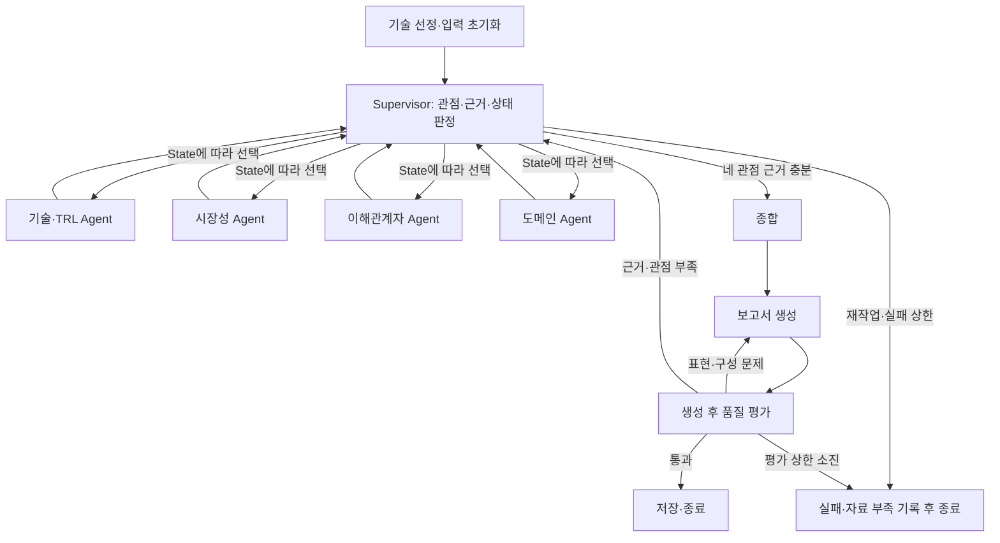

# Supervisor 아키텍처 제안

> 초기 대안 검토 문서. 이후 팀은 Orchestrator-Workers 강화를 선택했습니다. 최신 근거는 [Orchestrator 선택 문서](../05_Decisions/Orchestrator_Selection.md)를 따릅니다. 이 문서의 Supervisor 제안은 구현하지 않았습니다.

상태: 구현 전 팀 검토안. 기존 4개 관점 Agent를 최대한 재사용하는 설계다.

## 패턴 선택

| 패턴 | 이번 프로젝트에서의 장점 | 비용과 주의점 |
|---|---|---|
| Supervisor — 추천 | 관점별 부족한 근거를 확인하고 필요한 Agent만 재호출하기 쉬움; 기존 역할별 모듈 재사용 | 순차 라우팅으로 지연이 늘 수 있고 중앙 판단 실패가 전체 흐름에 영향 |
| Orchestrator-Workers — 대안 | 기술×관점×추가질의 계획에 따른 동적 병렬 조사에 적합 | 구조화 task 계획, `Send` 기반 Fan-out, 결과 reducer, 실패 task 재시도 설계를 추가해야 함 |

일정과 기존 코드 재사용을 고려해 Supervisor를 우선 제안한다. Orchestrator를 선택한다면 처음부터 4개 Worker를 항상 실행하는 형태는 과제의 Dynamic Fan-out 조건을 충족하지 못한다. LangGraph 공식 문서의 [동적 Worker 예제](https://docs.langchain.com/oss/python/langgraph/workflows-agents)를 참고한다.

## 예정 실행 흐름



Supervisor가 구조화된 결정 `action, target_view, reason, gaps, queries`를 반환한다. `add_conditional_edges`는 이 결정에 따라 네 Agent/종합/실패 종료를 선택한다. 근거 수만으로 통과하지 않고 필요한 주장과 근거의 관련성·관점별 충족 여부를 확인한다.

종료 상한은 안전장치이며, '정해진 횟수만 실행하면 보고서 작성'이라는 성공 판정을 대신하지 않는다. 상한 도달 시 `failed`나 `insufficient_evidence`로 종료하고 성공 보고서로 표시하지 않는다.

## 통신과 작업 계약

Supervisor가 하위 Agent에게 `view`, `selected_technologies`, `domain`, `feedback`, `queries`, `attempt`, `trace_id`를 전달한다. Agent는 다른 관점 Agent 함수를 호출하거나 다른 Agent의 결과를 직접 변경하지 않는다. 필요한 선행 정보는 Supervisor가 선택해 전달한다.

Agent 결과 제안:

```text
PerspectiveResult
  view: technical | market | stakeholder | domain
  status: success | insufficient | error
  findings: 관점별 분석 — 기존 분석 dict를 adapter로 유지 가능
  claims: [{claim_id, text, evidence_ids, limitation}]
  source_ids: [근거 ID]
  gaps: [보완할 주장·자료]
  error: 오류 코드와 짧은 설명 또는 null
  attempt: 이번 관점 호출 횟수
```

`technical` 결과에 기존 `technical_analysis`와 `trl_analysis`를 함께 담는다. 첫 단계에서 기존 결과 형식을 모두 바꾸지 말고 adapter 계약부터 맞춘다. 재작업 시 `feedback`과 `queries`를 실제 검색·프롬프트에 반영해야 한다.

## State Schema 7항목

아래 필드와 상한 수치는 팀이 합의할 제안이다. State의 모든 필드를 한 번에 중첩 dict로 전환할 필요는 없지만 역할 구분은 명시한다.

| 항목 | 제안 설계 | 검증 방법 |
|---|---|---|
| 제어 vs 페이로드 | 제어: next_action, active_view, step_count, attempts_by_view, node_status, repair_count, last_error. 결과: perspectives, synthesis, report, quality_verdict | 라우터는 결정·최소 요약만 읽고 근거 본문 전체를 중복 전달하지 않음 |
| 관측성 위치 | 최근 결정 요약만 State; 전체 decision/reason/ts는 JSONL·LangSmith | 결정 이유가 trace에 남고 State에 전체 로그가 쌓이지 않음 |
| 지속성 비용 | 원문은 Chroma/PDF 또는 run별 evidence 파일; State는 근거 ID·짧은 요약·경로. 관점 결과는 최신 버전으로 교체 | 재작업 후 State 크기 측정; 원문·raw LLM 출력 누적 금지 |
| 상관 | trace_id(업무 실행), thread_id(checkpoint), LangSmith run_id를 metadata/manifest에서 연결 | 보고서·JSONL·PNG·trace가 동일 run임을 확인 |
| 재개/복구 | 관점 상태·횟수·완료 결과·에러 저장; checkpointer와 같은 thread_id로 재개 | 중단 뒤 완료 관점 보존, 진행 상태 확인. 프로세스 재시작 복구는 영속 saver 필요 |
| 동시 처리 | Supervisor 하위 호출은 순차; references는 ID 기준 reducer. 동시 쓰기 필드와 merge 규칙 문서화 | 동일 근거 ID 멱등 병합; 중복 URL이어도 인용 ID 유실 금지 |
| 종료 보장 | 예시: 관점 최대 3회, report repair 최대 2회, 전체 step 최대 30; recursion_limit는 보조 가드 | 영구 실패 입력이 유한 종료되고 성공으로 처리되지 않음 |

기존 `merge_references`는 같은 URL/청크의 항목을 하나로 합친다. 이전 결과에서 참조한 ID를 제거하면 인용이 깨질 수 있으므로 ID를 안정화하거나 alias 매핑을 유지한다. 실패 로그도 무한 누적하지 말고 외부 로그에 전체 내용을 두고 State에 최근 오류만 저장한다.

체크포인트는 [LangGraph persistence 공식 문서](https://docs.langchain.com/oss/python/langgraph/persistence)를 기준으로 구현한다. InMemorySaver의 실행 중 복구와 디스크 기반 프로세스 재시작 복구를 구분한다. 저장 코드가 없는데 재개 기능을 구현했다고 보고하지 않는다.

## 보고서 생성 후 Hybrid 품질 평가

권장 방식은 규칙 검사 + 구조화 LLM Judge다. 구조 검사만 사용할 수도 있지만 내용 검증의 한계를 보고서에 명시해야 한다.

| 항목 | 규칙 검사 | 내용 Judge와 후속 처리 |
|---|---|---|
| Groundedness | SUMMARY·REFERENCE, 주장별 ID 존재·등록 여부·인용 연결 | 원문이 주장을 뒷받침하는지 검토. 근거 부족이면 해당 관점 재조사 |
| 중립성 | 우열·추천 표현 후보 탐지 | 조건부 해석과 승자 추천을 구분; 표현 위반이면 보고서 재작성 |
| 편향 통제 | 출처/기술/관점별 분포, 홍보·논문·독립 출처 구분 | 근거가 한쪽에 편중됐는지 판정. 독립 근거가 없으면 부족함을 밝히고 추가 조사 |
| 관점 커버리지 | 기술·TRL, 시장성, 이해관계자, 도메인 절 존재 | 절 제목만 있고 내용이 비어 있지 않은지 확인; 누락 관점 재작업 |

고정 출처 개수만으로 편향을 통과시키지 않는다. 직접 근거와 관련 생태계 자료를 구분하며, 찾지 못한 사실은 미확인으로 남긴다.

```text
QualityVerdict
  passed: bool
  criteria: {groundedness, neutrality, bias_control, coverage}
  각 기준: {passed, reasons, affected_claims, affected_views}
  repair_action: accept | rewrite_report | research | stop
```

본문 ID를 숨기려면 별도 `claim_evidence_map`을 반드시 보존하고 실제 최종 본문과 매핑이 맞는지 평가한다. 과제 일정상 주장 뒤 `[rag-…]`/각주를 표시하는 방법이 더 단순하다. 형식 수정과 근거 재조사를 구분하면 전체 파이프라인을 매번 재실행하지 않아도 된다.
